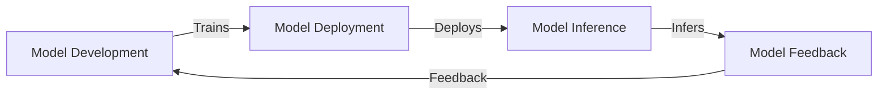

# Model Provenance
A toolkit for tracing AI model lineage and provenance.
## Problem Statement
AI models can be complex and difficult to understand, making it challenging to identify potential biases and errors.
## Why it Matters
By tracking model lineage and provenance, developers can ensure transparency and accountability in AI decision-making.
## Architecture

## Project Structure
```
model-provenance/
|---- README.md
|---- CONTRIBUTING.md
|---- requirements.txt
|---- main.py
|---- src/
|       |---- core.py
|       |---- utils.py
```
## Installation
```bash
pip install -r requirements.txt
```
## Quick Start
```bash
python main.py --help
```
## Configuration
```json
{
    "model_name": "my_model",
    "model_version": "1.0"
}
```
## Design Decisions
* Modular structure for easy extension and maintenance
* Utilizes provenance metadata to track model lineage
## Roadmap
* Implement model versioning
* Integrate with popular AI frameworks
## Contribution
Please see CONTRIBUTING.md for guidelines.
## License
MIT License
